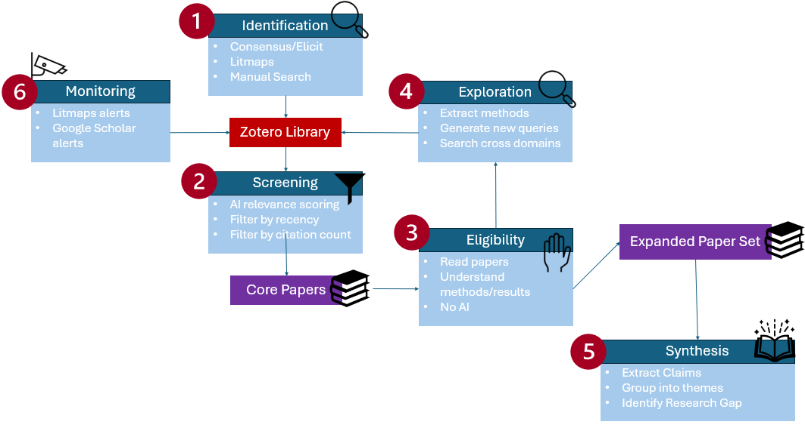

# Process log

This document describes how I came up with the workflow.

## Phase 1 - Idea finding
To get more ideas I prompted ChatGPT with both the task description and my own ideas. 
I used the following prompt:
>I have the following task: Goal: Implement one new-to-you AI workflow that measurably helps your PhD. Examples: Verified literature review copilot (with claims log and citation audit). Reproducible AI‑assisted data analysis (script/notebook + tests). Slide/figure content generator (storyboard + two production‑ready figures/diagrams). Lab ‘research assistant’ (prompted SOPs, to‑do triage, meeting minutes with action items). Deliverables (submit 48h before Session 6): Artifact (repo, notebook, slides, or toolkit). Process log (prompts, versions, sources, validation notes, time required for tasks). 2‑page reflective summary (what worked/failed, risks, next steps). Short live demo (5–7 min) + Q&A. Pass criteria (rubric excerpt, with deepening questions during the Q&A): Novelty & relevance: clearly new to the participant and relevant to their PhD. Integrity: transparent AI use; proper source handling; no fabricated citations. Reproducibility: others can run or follow the workflow; code/tests where applicable. Impact: time/quality gains evidenced (before/after or baseline vs. improved). Reflection: risks/limits identified; plan for sustained use. I have had the following ideas:
>1) Presentations are always quite hard for me. So I was thinking about developing a workflow that can produce a good storyline, help me adjust the presentation to the audience, provide me with a good start and end, can help me with visualizations and design. For this I was thinking of using different tools and come up with a workflow. 
>2) Currently, I am reading a lot of papers. I was thinking of how I can read more in a shorter amount of time and maybe also get relevant citations out of the papers. So I was thinking to start for example with writing a script that can search articles based on different keywords and then provide me with citations. Based on this maybe I can use AI to either select the most important ones, summarize them or find connections. I am not sure here. Of course it would also be nice to write a script that can fetch articles from the internet and provide me with updates if a new one is available. The ideas of a Copilot for literature reviews and the Lab research assistant I also like a lot. But could you explain this further to me? Also give me further ideas and help me to choose one of them.

The result helped me to understand each idea better and which steps are involved in each idea. Based on this and considering my current situation I decided to go with the literature review workflow as I think this can help me the most at the moment. I don't know when I have to hold my next presentation right now.

## Phase 2 - First Implementation
My first idea was to implement this as a Python script which:
1) Fetches articles from different sources
2) Scores the papers using an LLM and sorts them based on the score
3) Summarizes the paper with 2-3 sentences
4) Extracts their main claims with citations
5) Groups the claims into different themes
6) Generates a report
ChatGPT was used as help during the implementation to set up a code base.

However, I quickly realized a few problems when implementing this:
1) Fetching the papers was not as easy as I thought. Retrieving them from Arxiv was implemented very fast, but when retrieving them from Semantic Scholar some kind of rate limit was reached multiple times. I wanted to implement different sources and also wanted to make sure that I can include sources with peer reviewed articles, but this was not as easily realizable as I thought. 
2) Using the output from the LLMs was a big problem. I tried to define in the prompt very clearly and state what kind of output I was looking for, for example: "Return ONLY valid JSON. Do not include explanations outside JSON.". This worked sometimes but a lot of times I got errors back. I tried to work around this but did not find a solution that was very reliable. Personally, I don't think it makes so much sense to use a scoring system if half of the papers are not included in the scoring. Also this impacts reproducibility a lot as it is likely that you get different results everytime when running this pipeline.
3) Lastly, I was limited regarding the usage of LLMs. I did not want to pay for any usage, so I decided installing ollama and using a local llm. This did work, and you also have some options of choosing between models, however I think your results might be limited in terms of quality. I did not put too much time on figuring this out, as I decided fairly quickly that I wanted to solve this another way.

Based on these problems I decided to resolve the workflow with different tools in the end. Personally, I think the first step of getting good papers is quite important. And this way it was just easier to do so.

Something else that I realized at this stage was that most papers scored with 6 points. At this point I did not look into this further but wrote it down to look at it again at a later stage of the project. 

## Phase 3 - Second Implementation
I started by looking back at the module from this course where we did a literature review. Based on PRISMA I started thinking how to realize the three states: Identification, Screening, Included papers. 
I designed a workflow based on some tools that I am currently using and on tools that I got to know during this course. However, I have not been using this workflow before. I have started using some of the tools as part of this course and am still figuring out how to effectivly implement them into my processes. Therefore, I wanted to design a workflow that fits to these tools.
I also took some inspiration from the following YouTube videos and webpages:
- https://effortlessacademic.com/using-ai-for-literature-review-in-2025/
- https://www.youtube.com/watch?v=jJntl74QNWo
- https://www.youtube.com/watch?v=Vu9pqLD-yHs
This second implementation shifts from full automation to a hybrid human-AI workflow.

Final workflow:
1) Identification of Papers (Consensus, Litmaps, Manual Search)
2) Screening (AI-assisted and based on year + citation count + (venue))
3) Manual Reading
4) Extraction + synthesis (AI-assisted)
5) Exploration
6) Monitoring

### Description of the tools used

#### Consensus
Consensus I wanted to use in the Identification phase to both get a better understanding of the topic in general and to find relevant papers that can be used as a starting point. I think Consensus can give a very good overview especially if you are new to the topic which will help you to understand the topic better.
#### Litmaps
I have started using Litmaps as part of my PhD and really liked it so far. It highlights connections very well and proposes other related papers. 
#### Manual Search/adding of papers
Personally, I enjoy the process of looking for papers a lot. Just the searching goes quite easy as well and you might find different papers than the ones that Consensus or Litmaps provide you with. Therefore, I decided to include this as a step. Basically you can choose any kind of database and look for papers that sound interesting yourself. What is important however, is to not spend any time on understanding the paper. 
#### Zotero
I found out that Zotero integrates well with Consensus and Litmaps and therefore decided to use it as a paper base. I have recently started using it myself and really like the functionalities so it fit perfect in this workflow.
#### AI-assisted Screening/Extraction/Exploration
I wanted to limit the use of AI in this workflow, mainly due to sustainability aspects. Therefore, I wanted to design prompts that can be used once at a time and do not have to be repeated much. However, some of the workflow can be repeated but I tried to keep it to a minimum. 
Furthermore, I wanted to add steps where the user gets a deeper understanding himself about the topic, so that he/she can decide whether the AI-based output is valid enough. This is why for the screening I wanted to also look manually at recency and citation count. Then the user needs to actually read some papers in depth to get a better understanding of the topic and list interesting methods etc. 
Regarding the exploration step, I personally think that it is very easy to focus on one topic/direction. However, a lot of times there exist similar problems in other areas and often we can take inspirations from these to solve our own problem. I therefore decided to add this step to hopefully get more ideas what other areas to explore. However, here I am not looking for a perfect output but see it more as a starting point to get more creative yourself.

For defining prompts I first wrote down what I thought was important to include, created a prompt from this with ChatGPT and then used [Prompt optimizer](https://promptoptimizer.tools/) to optimize my prompts. Sometimes I had a few rounds of this going for and back.

I also kept some of the older prompts under (old_prompts.md)[./old_prompts.md].

## Validation
I decided to try out the workflow on the research question that I am currently interested in however at a smaller scale. During the validation I also decided to change the workflow and some prompts a bit which I will describe in this section as well.

### Identification of papers
First I used the following research question: How does the occlusion level affect amodal appearance completion?
With deep Search I got a set of 50 papers that were relevant for my research question. However, when going through these papers I realized that mostly psychology literature was included due to my unclear prompt. This again showed me how much the result can change depending on by just slightly changing the input. 

I changed the research question to the following: How does occlusion level influence the performance of machine learning models on amodal completion tasks?
This time I got results that were much more related to my research topic. 

Using Litmaps I started with some of the papers that were highly recommended by Consensus. With this I got 21 more papers (however some of them were already included in my 50 papers from Consensus).

I added 4 very recent paper that I found on arxiv by manually searching. After removing duplicates I had a total of 63 papers in Zotero.

### Screening
First of all, I screened them by the year they were published to get a better understanding. Looking at the citation count was not working well sadly. I think this could be very useful as it is an important factor when looking at the impact of the paper. Especially when the paper is very new and has a good citation count this can be a good hint to check out the paper. In my collection I saw that one paper was from 2025 with a citation count of 30 which is fairly good I would say.

Using the AI-based screening I got 10 papers. What was actually a bit weird is that I got a list with ten papers and the explanation why these are important. But on the right side it showed me a list of 20 papers. The first ten were the ones that were also in the output. So I wanted to only download the first 10 papers but that was somehow not possible. So I ended up with 20 papers in Zotero and had to filter them out manually which was a bit annoying. 
All in all, based on what I have already read in this field I think the papers that I got were quite good ones and definitely a good point to start. I actually realized that when screening the papers the first time, I got a lot of older papers back. While it can definitely be good to look at older papers, a lot has happend in this field in the last 2 years. That is why I added Recency as a scoring point to the prompt as well as novelty. By doing so, I got more recent papers as output. 

=> results can be seen under (core_papers.md)[./example_outputs/core_papers.md]

### Reading the papers
During the validation I did not read through all the core papers. Some of them I had already read through and written down some notes so I decided to test the next steps based on these notes. 
The notes can be found here: (notes_from_papers.md)[./example_outputs/notes_from_papers.md]

### Extraction and Exploration
Originally, I designed the workflow so that the notes taken in the reading step should be used as input for the exploration prompt. However, I thought a lot about what inputs I should use here (only notes, also papers?). For the extraction step I was thinking the same. First I wanted to take the papers as an input, but then I thought that by reading and taking notes I basically had already extracted the key claims so this step felt a bit unnecessary. But I realized that grouping my notes into themes to also connect between papers might be very useful to get a better overview. After adjusting the prompt I decided to actually switch the exploration and extraction step so that I would first group my notes into themes and then use these strutucered notes for the exploration step.

The original workflow can be seen here:

### Extraction
As explained before, I tried this step on some of my own paper notes: (notes_from_papers.md)[./example_outputs/notes_from_papers.md].
An example output can be seen here: (extraction.md)[./example_outputs/extraction.md]
Personally, I think this step is very useful to get a better overview and also find connections between the articles. Also this might help a lot for the writing process later on. 

### Exploration
Based on the structured notes I got from the previous step I tried out the exploration prompt. I changed this prompt a bit to also include any papers if they are known. When using this prompt I think it is important to note that the output should be taken mostly to expand your search and get some inspiration for related fields. I think this can be very helpful which is why I wanted to include this step.
An example output can be seen here: (exploration.md)[./example_outputs/exploration.md]

## Time required for each task

| Task | Time (hours) | 
| :----------- |:--------------:| 
| Idea Finding        | 2             | 
| Implementation 1      | 6           | 
| Implementation 2      | 4          | 
| Documentation |  5   |
| Validation | 5 |
| Reflection |    2    |
| Presentation | 1 |
| Total | 25 |
