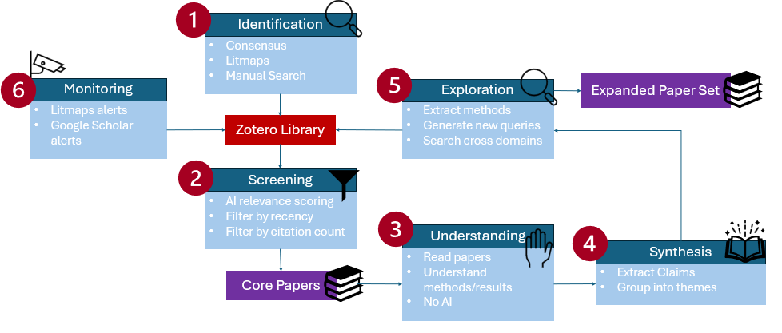

# Workflow description

This workflow combines PRISMA-inspired literature review steps with selective AI assistance for screening, exploration, and information extraction.



The workflow produces:
- a curated set of core papers
- structured notes
- a synthesis of themes 
- inspiration for connected topics


## Identification of papers
The goal of this step is to collect a good amount of papers based on a certain topic/research question. 

Tools to be used:
- Consensus
- Litmaps
- Manual search

### Consensus
Prompt Consensus with your research question. For this you can use the Deep Search method, to get a better overview. 
The output will give you a better understanding of the topic/area in general. Make sure to read it and save the named papers in Zotero in a new folder. This can be done by exporting the results as ".RIS" and then uploading them in Zotero.

### Litmaps
Use Litmaps to find more connected papers. As a starting point you can use the papers that Consensus marked as most relevant. Again, save the papers that you find in Zotero. In Litmaps on the top right you can click on articles and then "Export All". Here you can choose RIS which is supported by Zotero.

### Manual Search/adding of papers
Also check manually for papers in your topic. For this you can use your preferred databases. You can look for papers that sound interesting to yourself. What is important however, is to not spend any time on understanding the paper. A quick look at the title and at most the abstract should be enough. Upload the papers to Zotero.

### Zotero
All the papers found should be uploaded to Zotero as this will be used in the next steps. 
Target: ~20–50 candidate papers

## Screening the papers
Use the (screening prompt)[./prompts.md] in Consensus. For this you need to connect Zotero to Consensus so that it can access the papers that you have collected. On the left site in the tab menu navigate to "My Library". Here you can select the folder that you have created under Zotero after connecting it. As an output you will get a list with the most relevant papers.
To also get a good understanding yourself about the paper use Zotero to sort by the date that the papers were published. Furtermore, there exists a Plugin that can get the citation count from Google Schoolar. I tried it out but it does not work very great. However, I think this is a good way to get a rough idea about the impact of each paper. If during your manual search you have found some papers that have been published under a well known venue you can also keep these in mind.

Based on the list from Consensus and your manual screening you can of course adapt the list a bit if needed. Again these papers should be saved in Zotero in a new folder.

## Reading the papers
In this step you will now have to read through the selected papers. This is a very important step to get a better understanding of the topic yourself so that you can valididate later steps. Start by reading the abstract and then the conclusion and figure out from there if the paper is actually relevant.
While doing this note the most important methods, limitations, architecture etc. down. Basically what you find the most important.

## Structuring your Notes
Use the (extraction prompt)[./prompts.md] to structure your notes into grouped themes and connect them between papers. For doing so save the notes into one file with a clear distinction between each paper, for example:

````
Paper A
Titel:..
Notes:...

Paper B
Titel:..
Notes:...

and so on...
````
Make sure to update the exctraction prompt with the filename and your research question. 
For this step ChatGPT can be used for example. 

## Exploration of related research directions
Based on your structured notes created in the previous step you will now use the (exploration prompt)[./prompts.md] to receive further ideas. Create a file with the structured notes and upload them with the adjusted exploration prompt.

For this ChatGPT or any kind of other LLM can be used. However, the output should be used as inspiration rather than a definitive result. This step can help you to get more ideas also from related fields. The papers that you find you can either select manually or by using the screening step again.

## Monitoring
To stay up to date Litmaps provides a functionality to get notified if connected papers are being published. You can also setup alerts in Google Scholar or other databases for example. New papers can be re-integrated into the workflow starting from the screening step.